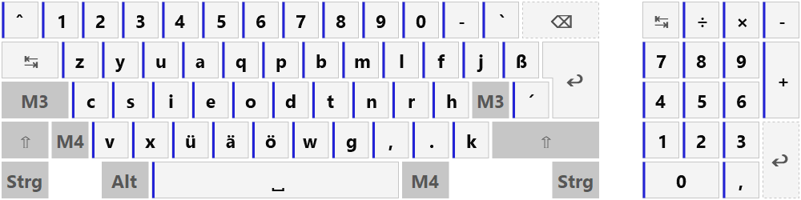

# AnaNeo – The Neo keyboard layout family on Windows

[**Diese Seite auf Deutsch**](README_DE.md)

> **AnaNeo is a fork of [ReNeo](https://github.com/Rojetto/ReNeo)** by Rojetto and qwertfisch. Most of the code originates from ReNeo and is licensed under GPL-3.0, as before. AnaNeo is a private project made public – see [About this fork](#about-this-fork) before you rely on it.

AnaNeo implements the [Neo keyboard layout](http://neo-layout.org/) and its relatives on Windows. There are two main modes of operation:
1. *standalone mode*: AnaNeo replaces all key events of the native layout (likely QWERTZ or QWERTY) with the desired Neo layout. You only need to run the AnaNeo executable on system startup.
2. *extension mode*: First, install a native Neo driver like [kbdneo](https://neo-layout.org/Einrichtung/kbdneo/). AnaNeo then supplements all functions that can't be implemented in the native driver (capslock, navigation keys on layer 4, compose, ...).



## About this fork

AnaNeo is not a competitor to ReNeo, it is one layout taken further. ReNeo carries the whole Neo family and stays close to the published standards; AnaNeo keeps four of those layouts – *Neo*, *NeoQwertz*, *Noted* and *AnNoted* (Bone, AdNW, Mine, KOY, VOU and 3l were dropped) – and puts the work into **AnNoted**, its own variant of *Noted*.

- **Refreshing Noted.** *AnNoted* keeps Noted's letter arrangement and its native driver (`kbdnoted.dll`), but is free to depart from the published standard where an extension has a reason to. *Noted* itself stays in the package unchanged as a standard-conform standalone layout, so nothing is taken away.
- **More layers.** *AnNoted* has 21 layers instead of 6: layers 1 to 4 as usual, then five themed blocks – maths, typography, Ancient Greek, Cyrillic, extra – and layer 21 for the compose modifiers. No physical key carries the block modifiers; a block is reached by locking it, which is why the lock model had to become a first-class part of the program rather than a switch for layer 4.
- **Systematising the functionality.** Any set of modifiers can be locked, and a lock is described in `config.json` instead of being hard-coded. The compose tree follows a stated grammar – *the layer carries the grip, the tree carries the derivation* – and two of the compose modules (font variants, enclosed characters) are generated from code rather than maintained by hand, with tests holding file and calculation together. A separate command-line build, `ananeo-tool`, reports on the compose stock: origin, coverage, gaps, duplicates, and which layer each continuation sits on.
- **The display was rebuilt, not invented.** The on-screen keyboard comes from ReNeo. What it *shows* is now computed in a separate, testable module; it renders glyphs through the font's own `cmap` table, so characters beyond the Basic Multilingual Plane (chess, alchemy, Mathematical Alphanumeric Symbols) appear instead of empty boxes; it carries a layer strip and a live preview of the running compose sequence. New alongside it is a printable, self-contained HTML **layout sheet**.

Unchanged from ReNeo is the part that is hardest to get right and easiest to break: the low-level keyboard hook, the modifier bookkeeping and the forced modifier state. That work is Rojetto's and qwertfisch's, and it is why this fork could concentrate on layouts and compose.

### How this repository was built

**AnaNeo is vibe-coded.** Almost all of the code, tests and documentation added in this fork were written by Claude (Anthropic's Claude Code agent) under human direction. Decisions, reviews and the manual acceptance testing are the human side of it: anything that touches the keyboard hook, the modifier state or the drawing cannot be proven by a unit test and has to be tried on a real Windows machine. Each development round therefore ends with a written acceptance protocol.

Two consequences worth knowing before you install it:

- The automated test suite is large and covers the pure data and logic modules – layout parsing, layer and lock logic, the compose tree, the key descriptions, the font `cmap` reader, the report generators. It does **not** cover the hook, the sending of key events, or the drawing itself.
- Development happened in a private working copy. The project log, the specifications and plans, and the acceptance protocols are German-language working documents and are **not part of this repository** – this README and `README_DE.md` are the parts written for readers from outside.

## Installation

1. *optional*: Install [kbdneo](https://neo-layout.org/Einrichtung/kbdneo/) normally
2. Download [newest release](https://github.com/reminiscience/AnaNeo/releases/latest) and unpack in a directory with write permissions, e.g. `C:\Users\[USER]\AnaNeo`
3. Start `ananeo.exe` oder [add it to the autostart list](docs/autostart.md). Use the tray icon to deactivate or quit the program.
4. *optional*: [Tweak `config.json`](#general-configuration) (generated on first start)

*Update*

Download new release and overwrite existing files with package contents. Because `config.json` isn't contained in the release package user settings are preserved.

*Uninstallation*

1. *optional*: Uninstall kbdneo according to Neo wiki tutorial
2. Delete AnaNeo directory and remove executable from autostart

## Features

General:

- Supports the layouts *Neo*, *NeoQwertz*, *Noted* and *AnNoted* – AnNoted is Noted's own variant with special spaces on the space bar; in extension mode against `kbdnoted.dll`, AnNoted is active, while Noted itself is only selectable in standalone mode
- Use tray menu to switch between layouts
- Lockable layers: Capslock (both shift keys), mod 3 lock (both mod 3 keys), mod 4 lock (both mod 4 keys) and further locks configured freely via `"locks"` in `config.json`. `M3+Esc` releases all locks. While a layer is locked, the tray icon changes color and the tooltip names the lock.
- Themed layers: Beyond layers 1 to 4 there are five themed blocks, each with its own block modifier (Mod5 to Mod9). A block is locked (`M3+F2` to `M3+F6`); once the base layer is locked, holding Shift, Mod3, or Mod4 reaches the block's other layers. No physical key carries Mod5 to Mod9 – every block is reachable exclusively through locking.

    | Layers | Trigger | Block |
    |---|---|---|
    | 1–4 | – / Shift / Mod3 / Mod4 | as usual |
    | 5–8 | Mod5 / +Shift / +Mod3 / +Mod4 | maths and logic (7 = superscript, 8 = subscript) |
    | 9–12 | Mod6 / +Shift / +Mod3 / +Mod4 | typography (11/12 carry three compose dead keys, rest still in reserve) |
    | 13–14 | Mod7 / +Shift | Ancient Greek, lower/upper case |
    | 15–16 | Mod8 / +Shift | Cyrillic (Russian) |
    | 17–20 | Mod9 / +Shift / +Mod3 / +Mod4 | extra: symbol zones, emoji (19), dice/alchemy/technology (20) |
    | 21 | Mod3+Mod4 | compose modifiers, reachable from **every** lock state |

    Layer 21 carries the six starting characters of the compose grammar on the home row, each on the initial letter of its category: `𝔵` font variant (S), `ⓧ` enclosure (E), `↻` rotation (D), `ₓ` subscript (T), `˞` retroflex hook (R), `ˣ` superscript (H). It is the only layer that exempts itself from locking – pressing `Mod3+Mod4` inside a locked block lands there instead of on layer 1. Example: `Mod3+Mod4`, `S`, release, then `d K` gives `𝕂`.

    Default triggers: `M3+F2` maths, `M3+F3` typography, `M3+F4` Greek, `M3+F5` Cyrillic, `M3+F6` extra. `M3+F7` adds Shift to the lock or removes it again, keeping you on the block's second layer.

    The space key carries its own hierarchy: layer 3 a non-breaking space, layer 4 a narrow non-breaking space, layer 5 a thin space, layer 6 a hair space, layer 7 a zero-width space; from layer 8 on it types normally. Layer 4's numpad-0 moves to `w` to make room. Until the grammar round the compose prefixes for super- and subscript sat on the `^` key; they now live on layer 21 together with the other modifiers, and `Mod3`+`^` no longer produces anything – the one spot where AnNoted deliberately departs from the Neo standard.

    **Only the *AnNoted* layout has these layers.** *Neo*, *NeoQwertz*, and *Noted* stay at their six published layers; of the themed-block triggers they ship only `M3+F2`, and there the lock is called `Mod3+Mod4` because it hits their existing layer 6.

    Two consequences of this layer split in AnNoted: `Shift+Mod3` has no layer of its own and falls back to layer 1 (`Mod3+Mod4` has hit the modifier layer 21 since the grammar round). And within a locked block, only the defined extensions (+Shift, and for maths, typography, and extra also +Mod3/+Mod4) reach a layer – anything else falls back to layer 1 as well; release the lock briefly with `M3+Esc` if you need special characters or navigation in between.
- **On-screen keyboard**: Toggle using tray menu or with shortcut `M3+F1`. Switches between layers as modifiers are pressed. While a layer is locked, a strip at the top names the current layer, its block, and the modifier set ("Layer 13 · Griechisch · Mod7"); if a compose sequence is running at the same time, it shares the strip. Also draws characters beyond the Basic Multilingual Plane correctly (chess, alchemy, Mathematical Alphanumeric Symbols); to do so, a bundled symbol font (*Noto Sans Symbols 2*, directory `fonts/`, licensed under the SIL Open Font License 1.1, text in `fonts/OFL.txt`) is loaded privately into the process at startup, without installing it. If no font has a matching glyph, the key shows its code point in small text instead of an empty box. Five color schemes are available; the default since package 5b is `Sachlich` (light/dark follows the Windows setting automatically) – anyone who previously had `ColorClassic` (the old default) set gets `Sachlich` automatically on the next start, while an explicitly chosen `ColorGreen` is left untouched.
- *All* dead keys and compose combinations. These can be extended by users; the list `composeModules` in `config.json` decides which `.module` files from the `compose/` directory are loaded, and in which order.
- Special compose sequences
    - Unicode input: `♫uu[codepoint hex]<space>` inserts unicode characters, e.g. `♫uu1f574<space>` → 🕴
    - Roman numerals: `♫rn[zahl]<space>` for lower case, `♫RN[zahl]<space>` for upper case. Numbers must range between 1 and 3999. Example: `♫rn1970<space>` → ⅿⅽⅿⅼⅹⅹ, `♫RN1970<space>` → ⅯⅭⅯⅬⅩⅩ
- Sticky modifiers: Some compose modifiers (e.g. `ˣ` superscript, `ₓ` subscript, `ⓧ` circling, `𝔵` font variant) keep the sequence open after emitting a character instead of ending it – the next keypress continues at the modifier. Example: `ˣ 1 2 3` gives ¹²³. Exit the modifier either with a key that has no compose entry (types normally again), with `Escape` (discards the whole sequence), or with the modifier itself (silent exit, does not type). **Pitfall:** `x ˣ 2 y` gives `x²ʸ`, not `x²y` – `y` is still typed inside superscript mode. The way out is one more press of the modifier: `x ˣ 2 ˣ y` → `x²y`.
- `Shift+Pause` de(activates) the program
- One-handed mode: If mode is enabled and space (default) is held, the whole keyboard is “mirored”. Toggle using tray menu or with shortcut `M3+F10`.
- Additional layouts can be added or modified in `layouts.json`.

## Layout sheet

Two ways to generate the current key layout as a printable HTML document:

- Tray menu → "Create layout sheet": shows exactly what the running program currently has loaded, and opens the file in the default browser.
- Command line: `ananeo-tool sheet [layout name]` generates the same sheet without a running AnaNeo, directly from the files in the executable's directory. Without a layout name, a sheet is generated for each layout. `ananeo-tool.exe` is a separate build that links neither Cairo nor the keyboard hook.

The sheet is a single, self-contained HTML file – no external references, usable without a network connection: one keyboard, one tab per layer, switching by click via a small amount of JavaScript. When printing (print preview is enough) or with JavaScript disabled, it instead shows all layers stacked below each other – the print form.

How to read it: an accent bar marks a key that produces a character, with its code point (`U+…`) below; keys without a bar, shown dimmed, are function keys (with their key name), modifiers get a filled background, and dashed outlines mark unassigned positions – the latter are the work list for remapping. The same reading applies to the on-screen keyboard under the `Sachlich` color scheme.

As an extension to the native driver:

- Navigation keys on layer 4
- If the native layout is recognized as Neo-related (`kbdneo2.dll`, `kbdgr2.dll`, `kbdnoted.dll`), AnaNeo automatically switches to extension mode. Switching between layouts is possible as normal.
- Improved compatibility with Qt and GTK applications. Workaround for [this bug](https://git.neo-layout.org/neo/neo-layout/issues/510).
- Compose key `M3+Tab` does not send tab character to applications. Workaround for [this bug](https://git.neo-layout.org/neo/neo-layout/issues/397).

## Configuration

AnaNeo can be configured with two files.

### General Configuration

`config.json` contains the following options:

- `"standaloneMode"`:
    - `true` (default): AnaNeo replaces the native layout (e.g. QWERTY) with the selected Neo layout. If the native layout is already Neo-related, AnaNeo won't change the layout and instead automatically switch to extension mode.
    - `false`: If the native layout is Neo-related, AnaNeo will switch to extension mode. For all other layouts AnaNeo deactivates automatically.
- `"standaloneLayout"`: Layout used for standalone mode. Can also be selected via the tray menu.
- `"language"`: Program language, `"german"` or `"english"`.
- `"osk"`:
    - `"numpad"`: Should on-screen keyboard show the numpad?
    - `"numberRow"`: Should on-screen keyboard show the number row?
    - `"theme"`: Color scheme for on-screen keyboard. `"Grey"`, `"NeoBlue"`, `"ColorClassic"`, `"ColorGreen"`, `"Sachlich"` (default since package 5b, light/dark follows the Windows setting)
    - `"layout"`: `"iso"` or `"ansi"`
    - `"modifierNames"`: `"standard"` (M3, M4, ...) or `"three"` (Sym, Cur)
- `"hotkeys"`: Hotkeys various program functions. Examples: `"Ctrl+Alt+F5"`, `"Shift+Alt+Key_A"`. Allowed modifiers are `Shift`, `Ctrl`, `Alt`, `Win`. The main key must be a VK from [this enumeration](https://github.com/reminiscience/AnaNeo/blob/develop/source/mapping.d) based on [this Win32 documentation](https://docs.microsoft.com/en-us/windows/win32/inputdev/virtual-key-codes). If a value is `null`, no global hotkey will be registered.
    - `"toggleActivation"`: Toggle AnaNeo keyboard hook.
    - `"toggleOSK"`: Toggle on-screen keyboard. In addition, `M3+F1` is preconfigured as a trigger under `"locks"`.
    - `"toggleOneHandedMode"`: Toggle one-handed mode. In addition, `M3+F10` is preconfigured as a trigger under `"locks"`.
- `"blacklist"`: List of programs for which AnaNeo should be deactivated automatically (e.g. X server, remote clients or games). A *RegEx* can be set with which the window title is compared. *Example*: Windows containing "emacs" or "Virtual Machine Manager" in their title should deactivate AnaNeo. The config then is
```
"blacklist": [
    {
        "windowTitle": "emacs"
    },
    {
        "windowTitle": "Virtual Machine Manager"
    }
]
```
- `"autoNumlock"`: Activate Numlock automatically? For optimal compatibility this should always be set to `true` if the keyboard has a real number pad. However, this may cause problems for laptops with a native number block located on the letter keys. In that case, disable this feature with `false`.
- `"composeModules"`: List of compose modules to load – in exactly this order. Write the file name without its extension; the file lives in `compose/`. When two sequences collide: a sequence extending an existing one, or ending prematurely inside one, is discarded; an exact duplicate overwrites the earlier result. The debug build writes a report about this to the log once loading finishes. Each module may have a `.remove` file of the same name that removes entries again. It is read if its module is on the list, and additionally every `.remove` file with no matching module – that one belongs to a built-in special routine such as Unicode input (`unicode.remove`). The default omits `klingon` and `klingon-kp` (together two thirds of the loading time).
- `"locks"`: Lockable layers and their triggers.
    - `"oskAutoShow"`: Should the on-screen keyboard open automatically while a layer is locked? It closes again when the lock is released, unless it was already open before.
    - `"triggers"`: List of triggers. Each entry has a `"chord"` and either `"lock"` or `"action"`.
        - `"chord"`: The same modifier twice (`"Shift+Shift"`, `"Mod4+Mod4"`) means "left and right key together". Otherwise all parts but the last are held modifiers and the last one is the main key, e.g. `"Mod3+Escape"` or `"Mod3+F2"`. The main key is a VK name without the `VK_` prefix.
        - `"lock"`: List of modifiers to lock, e.g. `["Mod4"]` or `["Mod3", "Mod4"]`. Allowed are `Shift` and the Neo modifiers `Mod3` to `Mod9`. `Ctrl` and `Alt` cannot be locked – a permanently locked Ctrl would hijack every application shortcut. This makes every layer from the second one upwards lockable.
        - `"mode"`: `"replace"` (default) replaces the current lock; the same trigger again releases it. `"toggle"` instead switches the named modifiers into or out of the current lock – so a single Shift trigger locks the second layer of any themed layer.
        - `"name"`: Display name in the tooltip. Defaults to the locked modifier set, e.g. `Mod7+Shift`.
        - `"action"`: A fixed function instead of a lock – `"capslock"` (toggle the operating system's Capslock), `"clearLocks"` (release all locks), `"osk"` (on-screen keyboard), `"oneHandedMode"` (one-handed mode) or `"compose"` (start a compose sequence). The default binds `"compose"` to `Mod3+Tab`: as a trigger it works in **every** lock state, whereas the `Multi_key` on layer 3 of the Tab key is lost whenever a layer is locked.
    - A locked Neo modifier counts as pressed as long as its key is **not** held. Holding the key returns to the unlocked layer for as long as it is held. **Exception Shift:** holding Shift does not lift a Shift lock – Shift stays visible to applications so that Shift shortcuts and Shift+Click keep working. Alongside other locks, Shift works normally and thus reaches the second layer of the locked block.
    - The former option `"enableMod4Lock"` is gone. It is removed on first start; if it was `false`, a `"locks"` section without the mod 4 trigger is created.
    - **After an update:** merging with `config.default.json` replaces arrays as a whole, not field by field. If you already have a `config.json`, newly added triggers will not appear automatically. Delete the `"triggers"` entry – or the whole `"locks"` block – from your `config.json` once and restart AnaNeo. **The same applies to `"composeModules"`:** that is an array too, and merging adds nothing inside it. Coming from a version before the grammar round, delete that entry once as well – otherwise the removed `math-font` is still looked up and the new font table `ananeo-schrift` is never loaded.
- `"filterNeoModifiers"`:
    - `true` (false): Key events for M3 and M4 are filtered in extension mode so that other programs won't see these events. Workaround for [this Bug](https://git.neo-layout.org/neo/neo-layout/issues/510).
    - `false`: Programs see M3/M4 events. Necessary if functions need to be bound in these applications.
- `"oneHandedMode"`:
    - "`mirrorKey"`: Scancode of the key used to mirror the keyboard, set to space bar (`44`) by default.
    - "`mirrorMap"`: Map of mirrored keys by scancode in the form of `"[original key]": "[mirrored key]"`. May have to be tweaked for ergonomic or matrix keyboards.

### Modifying layouts

Layouts can be added and modified in `layouts.json`. Every entry containst the following parameters:

- `"name"`: Name of the layout as displayed in the tray menu.
- `"dllName"` (optional): Name of the respective native driver DLL. If there is none, this parameter may be ommitted.
- `"modifiers"`: Scancodes of all modifiers, native modifiers also have to be mapped. A plus `+` character at the end of the scancode sets the extended bit, e.g. `36+` for the right shift key. Possible modifiers are `LShift`, `LCtrl`, `LAlt`, `LMod3`, `LMod4` (right variants as well) and the additional mod keys `Mod5` to `Mod9`.
- `"layers"`: Modifier combinations for each layer. Layers are tested and runtime and the first one where all modifiers fit the set values is chosen.
- `"capslockableKeys"`: Array of scancodes influenced by capslock. These are typically all letter keys.
- `"map"`: The actual layout as an array for each scancode. Every array has as many entries as there are layers – adding a layer means adding one entry per line. Missing entries are filled in as blank keys while loading and reported in the debug log; the layout still starts, but that layer stays silent there. Every entry contains:
    - `"keysym"`: X11 keysym, either from `keysymdef.h` or in the form of `U1234` for unicode characters. Used by compose.
    - **either** `"vk"`: Windows virtual key from the enumeration `VKEY` in `mapping.d`. Only used for navigation keys and special key combos.
    - **or** `"char"`: Unicode character that should be produced by this key.
    - `"label"`: (optional) Label for on-screen keyboard. `"char"` value is used as a fallback.
    - `"mods"`: (optional, exclusive to vk mappings) Modifiers that should be pressed (`true`) or released (`false`). Example: `"mods": {"LCtrl": true, "LAlt": true}`. Possible Modifiers are `LShift`, `RShift`, `LCtrl`, `RCtrl`, `LAlt`.

The following procedure is recommended to create a new layout:

1. Copy an existing layout and change the name
2. Re-order the letter key lines such that they correspond to the order on the keyboard read from the upper left to the lower right.
3. Use block selection to select the scancodes of an existing layouts and copy them over the (now unordered) scancodes of the new layout.
4. Use block selection to copy layers 3 and 4 of an existing layout to overwrite layers 3 and 4 of the new layout.
5. Change `modifiers` und `capslockableKeys` as necessary.

This results in layers 3 and 4 remaining as they were while the other layers permute according to the new letter layout.

The following regex can help with aligning the columns of a six-layer layout: `"[\dA-Fa-f]+\+?": *\[(\{.*?\}, *){5}\{`. Adjust the repetition count for layouts with more layers – `{20}` for the 21 layers of *AnNoted*.

# Virtual machines and remote desktop
As soon as several nested operatings systems interoperate things get difficult. Because different VM software and remote desktop clients behave differently there is no universal solution. What follows is some general advice and a few tested configurations.

For optimal compatibility, the *innermost* system should generally implement the alternative layout and all outer systems should be set to QWERTZ/QWERTY.
In the case of virtual machines this means QWERTZ on the host and a Neo driver on the guest system.
For remote desktop machines a local QWERTZ setup and a Neo driver on the remote system are recommended.

If it turns out that programs work better without AnaNeo, the offending programs can be added to the *blacklist* for AnaNeo to automatically deactivate, see [configuration](#general-configuration).

## WSL using VcXsrv as X server

Set Windows to QWERTZ (without AnaNeo), then set the Neo layout in X11 using `setxkbmap`.

## VirtualBox

Set host to QWERTZ, then install Neo driver (e.g. AnaNeo) in guest system.

## [Remote Desktop Manager](https://remotedesktopmanager.com/)

Use AnaNeo in standalone mode on the local system. Letters and (non-unicode) special characters are transmitted correctely to the remote system.

# For developers
## Compilation
AnaNeo is written in D and uses `dub` for project configuration and compilation.
There are three build settings:

1. Debug with `dub build`: In addition to debugging symbols, the generated executable opens instantiates a console to output debugging imformation.
2. Debug and log with `dub build --build=debug-log`: Similar to debug but console output is additionally written to `ananeo_log.txt`. Caution: this log file may contain sensitive information!
3. Release with `dub build --build=release`: Optimizations are active and no console is instantiated.

The resource file `res/ananeo.res` is built using `rc.exe` from the Windows SDK (x86 version, otherwise the generated res file won't work). The command ist `rc.exe ananeo.rc`.

Cairo DLL originates from https://github.com/preshing/cairo-windows. The D header files were generated from the C headers using [DStep](https://github.com/jacob-carlborg/dstep) and manually tweaked.

## Release
A tag of the form `v*` triggers a GitHub action to generate a release draft. Based on the different `config.[layout].json` files, several pre-configured ZIP archives are created.

# Librarys
Uses [Cairo](https://www.cairographics.org/) licensed under the GNU Lesser General Public License (LGPL) version 2.1.
